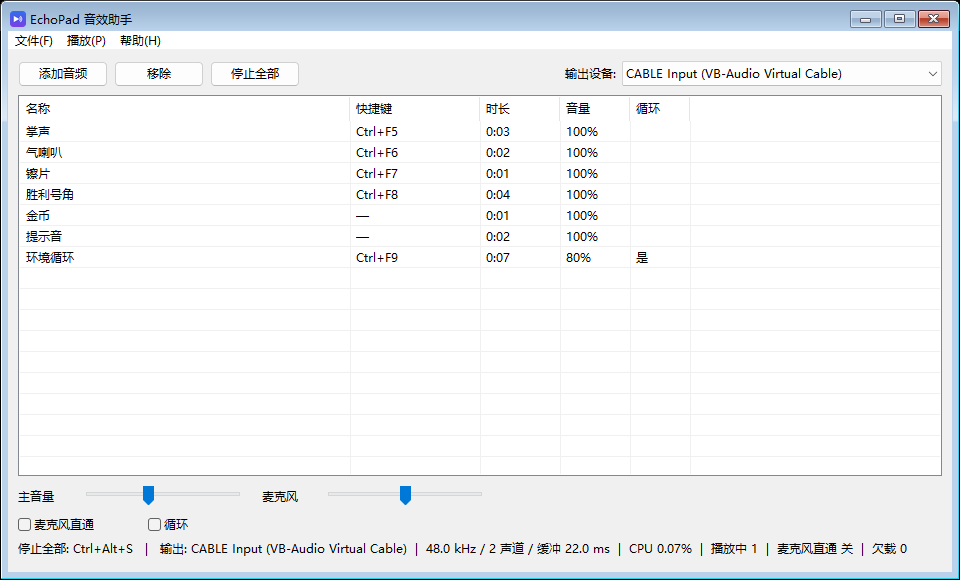

# EchoPad

**轻量级 Windows 音效板** —— 把自定义音频直接播进麦克风，让游戏和语音里的队友听到。
**A lightweight soundboard for Windows** — play your own audio clips straight into your microphone.

[中文文档](#中文文档) · [English docs](#english-docs) · [下载](#下载) · [Download the latest release](https://github.com/Sylvie1925/EchoPad/releases/latest)



---

<a id="中文文档"></a>

## 中文文档

### 为什么选它

市面上的音效板要么是 Electron 套壳，要么拖进 BASS/FMOD 再给每种格式塞一个解码器。
EchoPad 是一个纯手写的 Win32 程序：

| | |
|---|---|
| **单个 460 KB 的 exe** | 不用安装程序，不用 .NET，不用 VC++ 运行库，不带任何 DLL —— 所有依赖静态链接。 |
| **约 0.1% CPU，空闲时 0%** | 只有一个事件驱动的 WASAPI 渲染线程。没有播放、也没开麦克风直通时，音频客户端会被完全关掉。 |
| **麦克风直通** | 你的真实人声和音效混成一路送出去，**不需要**「侦听此设备」那种回环土办法。 |
| **全局热键** | 游戏全屏、EchoPad 缩在托盘里的时候照样触发。 |
| **一键急停** | 一个独立的全局键（默认 `Ctrl+Alt+S`）瞬间掐掉所有正在播放的音效 —— 把整首歌绑上去之后这个必不可少。 |
| **几乎什么都能解** | WAV / MP3 / M4A·AAC / WMA / FLAC / AIFF，走 Windows 自带的 Media Foundation 解码器。 |
| **最多 24 路同时播放** | 音频提前解码进内存，播放时不解码、不分配、不阻塞。 |

### 下载

<a id="下载"></a>

1. 到 [Releases](https://github.com/Sylvie1925/EchoPad/releases/latest) 下载 **`EchoPad.exe`**。
2. 放到任意目录，双击运行。

安装到此为止。需要 **64 位 Windows 7 或更高版本**，没有其它要求。

### 配置（约 5 分钟）

EchoPad 自己不创建虚拟声卡，它是往虚拟声卡里**播放**。下面以免费的
[VB-CABLE](https://vb-audio.com/Cable/) 为例。

**第一步：装虚拟声卡**

1. 下载 VB-CABLE 驱动包，右键 `VBCABLE_Setup_x64.exe` → **以管理员身份运行** → *Install Driver*。
2. **重启电脑**，否则新设备不会出现。

重启后系统里会多出两个设备：

| 端点 | 方向 | 含义 |
|---|---|---|
| `CABLE Input` | 播放 | 写到这里的声音会进到线缆里 |
| `CABLE Output` | 录音 | 进了线缆的声音从这里出来 |

**第二步：设置 EchoPad**

1. 「输出设备」选 `CABLE Input (VB-Audio Virtual Cable)`。EchoPad 检测到名字像虚拟声卡会自动帮你选上。
2. 勾选「麦克风直通」，这样你的真声也会混进去。
3. 点「添加音频」加入音效，双击任意一条试听。
4. 列表里右键 → 「设置快捷键…」→ 按下想绑的键。

**第三步：设置游戏 / 语音软件**

在游戏、Discord、TeamSpeak 等软件里，把**麦克风 / 输入设备**选成
`CABLE Output (VB-Audio Virtual Cable)`。

这样队友就能同时听到你的声音和音效 —— 因为 EchoPad 已经把它们混好了。

**第四步（可选）：让自己也听得到**

Windows「声音设置」→ `CABLE Output` → 属性 → 「侦听」→ 勾选「侦听此设备」→ 指向你的耳机。

> 千万不要把它指向 `CABLE Input`，那会形成回环啸叫。

### 使用

| 操作 | 说明 |
|---|---|
| 双击列表项，或选中后按 `Enter` | 播放 |
| **`Ctrl+Alt+S`** | **停止全部** —— 全局键，全屏游戏里也有效 |
| `Ctrl+O` | 添加音频文件（可多选） |
| `Delete` | 移除选中项 |
| `Space` | 播放选中项 |
| 右键列表项 | 播放 · 设置/清除快捷键 · 切换循环 · 音量 ±10% · 在资源管理器中显示 · 移除 |
| **「播放」菜单 → 设置“停止全部”热键…** | 换掉急停键。当前生效的键会显示在菜单、托盘菜单和状态栏上。 |
| 双击托盘图标 | 重新打开主窗口 |
| 右键托盘图标 | 显示 · 停止全部 · 麦克风直通 · 退出 |
| 关窗口 | 只是收进托盘，热键继续有效；要真正退出请用托盘菜单 |

音量分两档：**主音量**是总输出增益，**麦克风**只影响你说话的音量。单个音效的音量在右键菜单里调。
三者都可以超过 100%（最高 200%，单个音效 400%）。

### 性能

在 Windows 11 23H2 x64 上实测，输出到 VB-CABLE，48 kHz / 2 声道 / 22 ms 缓冲：

| 工况 | CPU |
|---|---|
| 启动，含后台解码 4 个音效（WAV/MP3/M4A/MP3） | 合计 0.094 秒 |
| 运行中，麦克风直通开启，无播放 | 低于单核 0.08%（20 秒窗口内低于计时器精度） |
| 运行中，麦克风直通关，引擎自动休眠 | **0%** |
| 内存占用 | 刚启动约 26 MB，解码 4 个音效后约 37 MB |

这些数字背后的设计取舍见[实现要点](#实现要点)。

### 配置文件

EchoPad 是绿色的：配置写在 exe 所在目录，只有当那个目录不可写（比如装在 `Program Files` 下）
才退回到 `%APPDATA%\EchoPad\`。

| 文件 | 内容 |
|---|---|
| `EchoPad.ini` | 输出/采集设备、麦克风直通、音量、已绑定的热键、上次打开的目录 |
| `sounds.tsv` | 音效列表 —— 名称、路径、快捷键、音量、循环，每行一个 |
| `echopad.log` | 滚动日志。出问题先看这里。 |

三个都是纯 UTF-8 文本，关掉 EchoPad 后用记事本改就行。

### 从源码构建

只有想改代码才需要这一步 —— Release 里已经有编译好的 exe 了。

<details>
<summary><b>方式 A —— MinGW-w64 / w64devkit（最简单）</b></summary>

```bat
cd EchoPad
build.bat
```

`build.bat` 会依次找 `tools\w64devkit\`、同级 `..\tools\`、最后是 `PATH` 里的 `g++`。
产物是一个自包含、不依赖任何运行时 DLL 的 `build\EchoPad.exe`。
脚本还会把编译器的临时目录指到 `build\tmp\`，所以在受限的机器上也能构建。

[w64devkit](https://github.com/skeeto/w64devkit) 是个约 64 MB 的自解压包，够构建这个项目，
不用安装程序，也不用改 PATH。
</details>

<details>
<summary><b>方式 B —— CMake / Visual Studio / CLion</b></summary>

```bat
cmake -S . -B build-vs -G "Visual Studio 17 2022" -A x64
cmake --build build-vs --config Release
```

CMake 构建使用静态 CRT，产出的同样是零依赖的 exe。需要安装 **「使用 C++ 的桌面开发」** 工作负载
（MSVC + Windows SDK）。
</details>

<details>
<summary><b>方式 C —— 直接用 g++</b></summary>

```bash
g++ -std=c++20 -O2 -mwindows -Isrc -Ires $(find src -name '*.cpp') res/echopad.rc -o EchoPad.exe \
    -lole32 -loleaut32 -luuid -lmmdevapi -lavrt \
    -lmfplat -lmfreadwrite -lmfuuid -lmf -lshlwapi \
    -lcomctl32 -lcomdlg32 -lshell32 -luser32 -lgdi32 -ladvapi32
```
</details>

项目使用 C++20，**没有任何第三方依赖** —— 只需要 Windows SDK。请保持这一点。

<a id="实现要点"></a>

### 实现要点

```
 音频文件 ──Media Foundation──▶ float32 / 48 kHz / 立体声 ──┐
                                                           ├─▶ 混音 ─▶ 主音量 ─▶ 削波 ─▶ CABLE Input
 真实麦克风 ──WASAPI 采集──▶ float32 ──────────────────────┘
```

**统一的混音格式，全程不做重采样。** 渲染设备用 `AUDCLNT_STREAMFLAGS_AUTOCONVERTPCM` 打开，
请求 48 kHz 立体声 float32，让 Windows 音频引擎去适配硬件格式。带来两个好处：换输出设备时
已解码的缓冲区依然有效，而且音频回调里**没有任何格式转换代码**。

如果某个端点不接受 `AUTOCONVERTPCM`，就退回设备原生混合格式，并让音效库在后台重新解码一次。

**没事发生时什么都不跑。** 两个音频线程都阻塞在 WASAPI 事件上 —— 没有轮询，没有
`timeBeginPeriod`。它们通过 `AvSetMmThreadCharacteristics(L"Pro Audio")` 申请 MMCSS 优先级。
当没有音效在播、也没开直通时，渲染客户端会被直接停掉，所以空闲的 EchoPad 占用就是零。

**音频回调里从不分配也从不释放。** 音效提前解码进内存，用 `std::shared_ptr` 引用。一路音效播完时，
它的引用被丢进一个无锁队列、由界面线程负责释放，所以几 MB 的缓冲区绝不会在回调里被 free。
麦克风采样通过无锁环形缓冲送到混音器；如果采集和渲染的时钟漂移导致积压超过 100 ms，
就丢弃最旧的采样重新对齐，而不是让延迟无限增长。

**热键用 `RegisterHotKey`** 注册到托盘窗口，所以游戏占着前台时依然有效。音效 id 直接用作热键 id，
急停键占用一个保留 id。

**关于削波。** 麦克风和音效相加后在 ±1.0 处硬削波。这是有意为之 —— 行为可预期，而且不花额外开销。
如果听到破音，把主音量或麦克风音量调低。

### 项目结构

```
EchoPad/
├── build.bat              MinGW 一键构建
├── CMakeLists.txt         MSVC / CLion 构建
├── LICENSE
├── docs/screenshot.png
├── res/                   图标、manifest（comctl32 v6 + 每显示器 DPI）、.rc
└── src/
    ├── common.h           公共类型、ComPtr、内部音频格式
    ├── main.cpp           WinMain、单实例
    ├── app.{h,cpp}        主窗口、控件、托盘、配置、命令分发
    ├── core/
    │   ├── util.{h,cpp}        路径、UTF-8 工具、日志、INI
    │   ├── ring_buffer.{h,cpp} 无锁 SPSC 队列与采样环
    │   └── guids.cpp           全程序 GUID 的唯一实例化点
    ├── audio/
    │   ├── format.{h,cpp}      WAVEFORMATEX 识别与采样编码转换
    │   ├── devices.{h,cpp}     端点枚举、虚拟声卡识别
    │   └── engine.{h,cpp}      WASAPI 双工引擎
    ├── media/
    │   ├── decoder.{h,cpp}     Media Foundation 解码
    │   └── sound.{h,cpp}       音效目录、持久化、后台解码线程
    ├── hotkey/hotkeys.{h,cpp}  全局热键
    └── ui/
        ├── strings.h           全部界面文案
        ├── tray.{h,cpp}        托盘图标
        └── hotkey_capture.{h,cpp}  按键捕获弹窗
```

`core/guids.cpp` 看着奇怪但必不可少：MinGW-w64 的导入库里没有导出 WASAPI 的 GUID，
所以必须在一个翻译单元里包含 `<initguid.h>`，这样 MinGW 和 MSVC 才都能链接通过。

### 常见问题

**游戏里听不到音效。**
按顺序检查：EchoPad 的输出设备是不是 `CABLE Input`；游戏的麦克风是不是 `CABLE Output`；
「麦克风直通」有没有勾上（不勾的话队友只能听到音效、听不到你说话）。然后到 `echopad.log` 里
找 `engine started` 和 `decoded …`。

**热键没反应。**
那个组合已经被别的程序占了 —— 日志里会记 `RegisterHotKey failed`。换一个。如果你把同一个键
也绑给了急停键，那通常就是原因。

**有爆音或断断续续。**
把主音量降到 80% 以下。状态栏里的 `underruns`（欠载）计数如果一直涨，说明系统音频负载过高。

**构建时报 `Cannot create temporary file in C:\...\Temp: Permission denied`。**
`build.bat` 已经把编译器的临时目录重定向到 `build\tmp\` 了。如果你还是遇到，说明你用的是自己的
命令行而不是这个脚本 —— 把 `TMP` 和 `TEMP` 指到一个可写目录。注意 `GetTempPath()` 是**先看
`TMP`、再看 `TEMP`** 的。

**点「打开配置目录」弹出「打开方式」对话框。**
你机器上的文件夹关联坏了。EchoPad 直接调用 `explorer.exe` 而不是走 shell 动词；万一连这也失败，
它会弹窗把路径和错误码告诉你。

### 已知限制

- **仅支持 Windows** —— WASAPI 和 Media Foundation 都不具备可移植性。
- **界面只有中文。** 所有文案都在 `src/ui/strings.h`，翻译基本上就是再加一张表。
- **支持的格式取决于系统装了哪些 Media Foundation 解码器。** Windows 10/11 自带 WAV、MP3、
  AAC/M4A、WMA、FLAC。**不支持 OGG 和 Opus** —— 系统里没有对应解码器。
- **单个音效上限 10 分钟**，避免误点一个电影文件吃掉几 GB 内存。
- **没有播放列表、没有裁剪、没有单个音效的特效。** 音效原样播放。

### 参与贡献

欢迎提 Issue 和 PR。几条保持这个项目本来面目的底线：

- **不引入第三方依赖。** 如果某个功能需要库，那多半说明需要换一种设计。
- **音频回调里不许分配内存、加锁、写日志、碰文件系统。**
- **空闲开销必须保持为零。** 新的后台工作要事件驱动，不许轮询。
- 界面文案放到 `src/ui/strings.h`，不要内联写在窗口代码里。

没有正式的代码风格要求 —— 跟周围代码保持一致，并且保持 `-Wall -Wextra` 无警告即可。

### 许可证

[MIT](LICENSE)。随便用，商用也可以，保留版权声明即可。

EchoPad 与 VB-Audio 没有关联。[VB-CABLE](https://vb-audio.com/Cable/) 是 VB-Audio Software
的独立免费产品，这里只是作为虚拟声卡的例子。

---

<a id="english-docs"></a>

## English docs

### Why this one

Most soundboards are Electron apps, or drag in BASS/FMOD plus a decoder per format. EchoPad is a
single hand-written Win32 program:

| | |
|---|---|
| **One 460 KB exe** | No installer, no .NET, no Visual C++ redistributable, no DLLs. Everything is statically linked. |
| **~0.1% CPU, 0% when idle** | One event-driven WASAPI render thread. When nothing is playing and mic passthrough is off, the audio client is shut down completely. |
| **Microphone passthrough** | Your real voice and the clips are mixed into one stream, so you never need the "Listen to this device" loopback trick. |
| **Global hotkeys** | They fire even when a game has focus and EchoPad sits hidden in the tray. |
| **One-key panic stop** | A separate global hotkey (`Ctrl+Alt+S` by default) cuts every playing clip instantly — essential once you have bound a full-length song. |
| **Decodes almost anything** | WAV, MP3, M4A/AAC, WMA, FLAC, AIFF — through the Media Foundation codecs already installed on Windows. |
| **Up to 24 clips at once** | Everything is pre-decoded into RAM, so playback never touches a decoder, allocates, or blocks. |

### Download

1. Grab **`EchoPad.exe`** from the [latest release](https://github.com/Sylvie1925/EchoPad/releases/latest).
2. Put it anywhere and double-click it.

That is the whole install. Requires **64-bit Windows 7 or newer** — nothing else.

### Setup (about 5 minutes)

EchoPad does not create a virtual audio device; it plays *into* one. [VB-CABLE](https://vb-audio.com/Cable/)
is free and is what the steps below assume.

**1. Install the virtual cable**

1. Download the VB-CABLE driver pack and run `VBCABLE_Setup_x64.exe` **as administrator** →
   *Install Driver*.
2. **Reboot.** The new endpoints do not appear until you do.

| Endpoint | Direction | Meaning |
|---|---|---|
| `CABLE Input` | playback | Audio written here goes *into* the cable |
| `CABLE Output` | recording | Whatever went into the cable comes back out here |

**2. Point EchoPad at it**

1. Set **输出设备 / Output device** to `CABLE Input (VB-Audio Virtual Cable)`.
   EchoPad preselects it automatically when it spots a cable-like name.
2. Tick **麦克风直通 / Microphone passthrough**, so your real voice is mixed in too.
3. Click **添加音频 / Add audio**, pick your clips, then double-click one to audition it.
4. Right-click a row → **设置快捷键… / Set hotkey** → press the key you want.

**3. Point your game or voice chat at it**

Set the **microphone / input device** in the game, Discord, TeamSpeak, and so on to
`CABLE Output (VB-Audio Virtual Cable)`.

Your teammates now hear your voice *and* the clips, because EchoPad already mixed them together.

**4. Optional — hear it yourself**

Windows **Sound settings** → `CABLE Output` → *Properties* → **Listen** → tick *Listen to this
device* → pick your headphones.

> Do **not** point that at `CABLE Input`; you would create a feedback loop.

### Usage

| Action | |
|---|---|
| Double-click a row, or select and press `Enter` | Play |
| **`Ctrl+Alt+S`** | **Stop everything** — global, works in full-screen games |
| `Ctrl+O` | Add audio files (multi-select) |
| `Delete` | Remove the selected row |
| `Space` | Play the selected row |
| Right-click a row | Play · set or clear hotkey · toggle loop · volume ±10% · reveal in Explorer · remove |
| **Play menu → Set "stop all" hotkey…** | Rebind the panic key. The live binding is shown in the menu, the tray menu and the status bar. |
| Double-click the tray icon | Reopen the window |
| Right-click the tray icon | Show · stop all · microphone passthrough · exit |
| Closing the window | Only hides it to the tray — hotkeys keep working. Use the tray menu to really quit. |

There are two volume stages: **主音量 / master** is the overall output gain, and **麦克风 / mic**
affects only your voice. Per-clip volume lives in the row's right-click menu. All of them go above
100% — up to 200%, or 400% for a single clip.

### Performance

Measured on Windows 11 23H2 x64, rendering to VB-CABLE at 48 kHz / 2 channels / 22 ms buffer:

| State | CPU |
|---|---|
| Startup, including background decoding of 4 clips (WAV/MP3/M4A/MP3) | 0.094 s total |
| Running, microphone passthrough on, nothing playing | below 0.08% of one core — under the timer's resolution across a 20 s window |
| Running, microphone passthrough off, engine auto-slept | **0%** |
| Working set | ~26 MB fresh, ~37 MB with 4 clips decoded |

The design decisions behind those numbers are in [How it works](#how-it-works-en).

### Configuration files

EchoPad is portable: it writes next to the executable, and only falls back to `%APPDATA%\EchoPad\`
when that directory is not writable (for example under `Program Files`).

| File | Contents |
|---|---|
| `EchoPad.ini` | Output and capture devices, microphone passthrough, volumes, bound hotkeys, last folder |
| `sounds.tsv` | The clip list — name, path, hotkey, volume, loop; one clip per line |
| `echopad.log` | Rolling log. Check here first when something misbehaves. |

All three are plain UTF-8 text and safe to edit in Notepad while EchoPad is closed.

### Building from source

You only need this if you want to modify EchoPad — the release already contains the executable.

<details>
<summary><b>Option A — MinGW-w64 / w64devkit (simplest)</b></summary>

```bat
cd EchoPad
build.bat
```

`build.bat` looks for a portable w64devkit in `tools\w64devkit\`, then a sibling `..\tools\` folder,
then `g++` on `PATH`. It produces one self-contained `build\EchoPad.exe` with no runtime DLL
dependencies, and points the compiler's temporary directory at `build\tmp\` so it also works on
locked-down machines.

[w64devkit](https://github.com/skeeto/w64devkit) is a ~64 MB self-extracting archive — enough to
build this project, with no installer and no PATH surgery.
</details>

<details>
<summary><b>Option B — CMake / Visual Studio / CLion</b></summary>

```bat
cmake -S . -B build-vs -G "Visual Studio 17 2022" -A x64
cmake --build build-vs --config Release
```

The CMake build uses the static CRT, so it also produces a dependency-free exe. Requires the
**Desktop development with C++** workload (MSVC + Windows SDK).
</details>

<details>
<summary><b>Option C — plain g++</b></summary>

```bash
g++ -std=c++20 -O2 -mwindows -Isrc -Ires $(find src -name '*.cpp') res/echopad.rc -o EchoPad.exe \
    -lole32 -loleaut32 -luuid -lmmdevapi -lavrt \
    -lmfplat -lmfreadwrite -lmfuuid -lmf -lshlwapi \
    -lcomctl32 -lcomdlg32 -lshell32 -luser32 -lgdi32 -ladvapi32
```
</details>

The project is C++20 and has **no third-party dependencies** — only the Windows SDK. Please keep it
that way.

<a id="how-it-works-en"></a>

### How it works

```
 audio file ──Media Foundation──▶ float32 / 48 kHz / stereo ──┐
                                                             ├─▶ mix ─▶ master gain ─▶ clip ─▶ CABLE Input
 real microphone ──WASAPI capture──▶ float32 ────────────────┘
```

**One mixer format, no resampling.** The render device is opened with
`AUDCLNT_STREAMFLAGS_AUTOCONVERTPCM`, asking for 48 kHz stereo float32 and letting the Windows audio
engine convert to whatever the hardware wants. Two consequences: decoded buffers stay valid when you
switch output devices, and the audio callback contains **zero** format-conversion code.

If an endpoint rejects `AUTOCONVERTPCM`, EchoPad falls back to the device's native mix format and has
the clip library re-decode in the background.

**Nothing runs when nothing is happening.** Both audio threads block on WASAPI events — no polling,
no `timeBeginPeriod`. They request MMCSS priority through
`AvSetMmThreadCharacteristics(L"Pro Audio")`. When no clip is playing and passthrough is off, the
render client is stopped outright, so an idle EchoPad costs literally nothing.

**The audio callback never allocates or frees.** Clips are pre-decoded into RAM and referenced by
`std::shared_ptr`. When a voice finishes, its reference is handed to a lock-free queue and released by
the UI thread, so a multi-megabyte buffer is never freed inside a callback. Microphone samples reach
the mixer through a lock-free ring buffer; if the capture and render clocks drift far enough apart to
build a backlog beyond 100 ms, the oldest samples are dropped to resynchronise, instead of letting
latency grow without bound.

**Hotkeys use `RegisterHotKey`** against the tray window, so they still fire while a game owns the
foreground. Clip ids double as hotkey ids; the panic-stop key gets a reserved id.

**About clipping.** The microphone and the clips are summed and hard-clipped at ±1.0. That is
deliberate — predictable and free. If you hear distortion, lower the master or microphone volume.

### Project layout

```
EchoPad/
├── build.bat              one-command MinGW build
├── CMakeLists.txt         MSVC / CLion build
├── LICENSE
├── docs/screenshot.png
├── res/                   icon, manifest (comctl32 v6 + per-monitor DPI), .rc
└── src/
    ├── common.h           shared types, ComPtr, internal audio format
    ├── main.cpp           WinMain, single instance
    ├── app.{h,cpp}        main window, controls, tray, config, command dispatch
    ├── core/
    │   ├── util.{h,cpp}        paths, UTF-8 helpers, logging, INI
    │   ├── ring_buffer.{h,cpp} lock-free SPSC queue and sample ring
    │   └── guids.cpp           the one place all GUIDs are instantiated
    ├── audio/
    │   ├── format.{h,cpp}      WAVEFORMATEX inspection and sample encoding
    │   ├── devices.{h,cpp}     endpoint enumeration, virtual-cable detection
    │   └── engine.{h,cpp}      the WASAPI duplex engine
    ├── media/
    │   ├── decoder.{h,cpp}     Media Foundation decoding
    │   └── sound.{h,cpp}       clip catalog, persistence, background decode thread
    ├── hotkey/hotkeys.{h,cpp}  global hotkey registration
    └── ui/
        ├── strings.h           every user-visible string
        ├── tray.{h,cpp}        notification-area icon
        └── hotkey_capture.{h,cpp}  the modal "press a key" popup
```

`core/guids.cpp` looks odd but is necessary: MinGW-w64 does not export the WASAPI GUIDs from its
import libraries, so including `<initguid.h>` in exactly one translation unit is how the project
links under both MinGW and MSVC.

### Troubleshooting

**The game cannot hear the clips.**
Check, in order: EchoPad's output device is `CABLE Input`; the game's microphone is `CABLE Output`;
microphone passthrough is ticked (without it your teammates hear the clips but not you). Then look in
`echopad.log` for `engine started` and `decoded …`.

**A hotkey does nothing.**
Something else already owns that combination — the log records `RegisterHotKey failed`. Pick another
one. If you assigned it to the panic-stop key as well, that is the usual cause.

**Crackling or dropouts.**
Lower the master volume below 80%. An `underruns` counter that keeps climbing in the status bar means
the system audio load is too high.

**`Cannot create temporary file in C:\...\Temp: Permission denied` while building.**
`build.bat` already redirects the compiler's temp directory to `build\tmp\`. If you still see it, you
are building with your own command line rather than the script — set `TMP` and `TEMP` to a writable
directory. Note that `GetTempPath()` consults `TMP` *before* `TEMP`.

**Windows shows an "open with" dialog for "Open config directory".**
Your machine's folder association is damaged. EchoPad launches `explorer.exe` directly instead of
going through the shell verb, and shows the path in a message box if even that fails.

### Known limitations

- **Windows only** — WASAPI and Media Foundation are not portable.
- **Chinese-only interface.** Every string lives in `src/ui/strings.h`, so translating it is mostly a
  matter of adding a second table.
- **Format support follows the installed Media Foundation codecs.** Windows 10/11 ship WAV, MP3,
  AAC/M4A, WMA and FLAC. **OGG and Opus are not supported** — no system decoder exists.
- **10-minute cap per clip**, so a mis-clicked movie file cannot swallow gigabytes of RAM.
- **No playlists, no trimming, no per-clip effects.** Clips play exactly as they are.

### Contributing

Issues and pull requests are welcome. A few ground rules that keep the project what it is:

- **No third-party dependencies.** If a feature needs a library, it probably needs a different design.
- **Nothing in the audio callback may allocate, lock, log, or touch the filesystem.**
- **Keep the idle cost at zero.** New background work must be event-driven, not polled.
- UI strings belong in `src/ui/strings.h`, not inline in the window code.

There is no formal style guide — match the surrounding code and keep `-Wall -Wextra` clean.

### License

[MIT](LICENSE). Do whatever you like with it, including shipping it commercially; just keep the
copyright notice.

EchoPad is not affiliated with VB-Audio. [VB-CABLE](https://vb-audio.com/Cable/) is a separate free
product by VB-Audio Software, used here only as an example virtual audio device.
